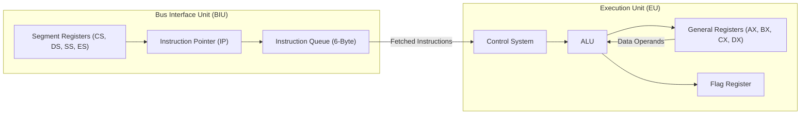
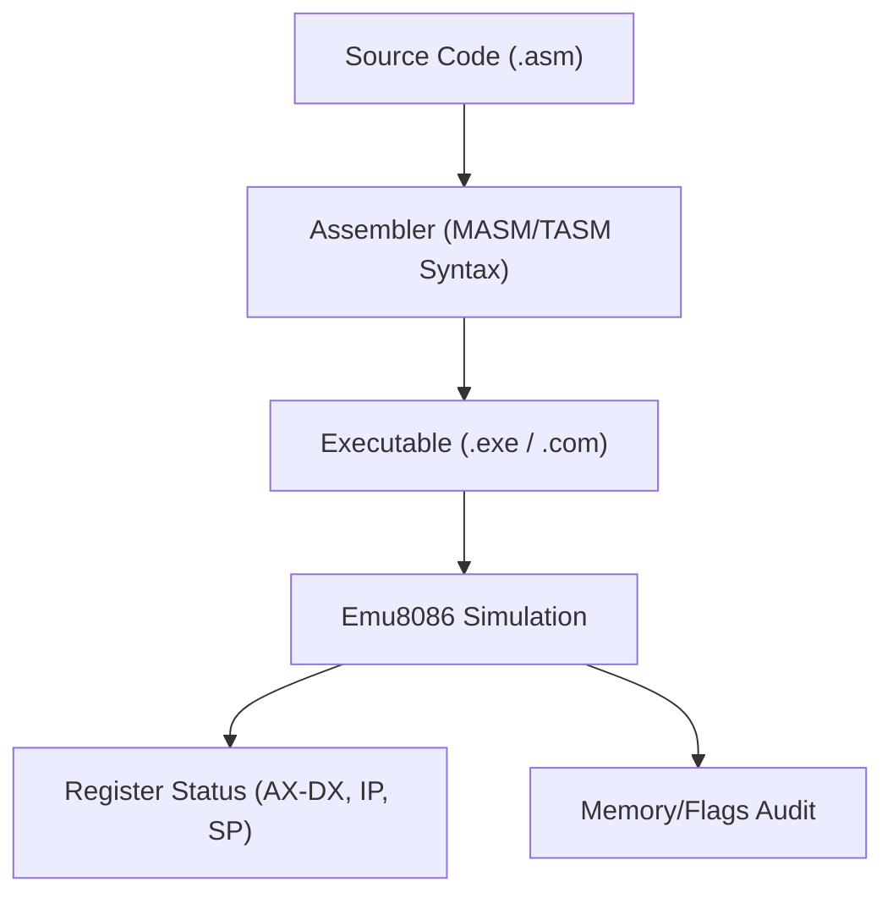

# Technical Specification: 8086 Assembly Language Programs

## Architectural Overview

This repository constitutes a comprehensive engineering archive of **161 Assembly programs** targeting the **Intel 8086 (16-bit)** microprocessor architecture. The programs demonstrate the full operational lifecycle of a CISC architecture, simulated within the **Emu8086** environment.

### CPU Internal Architecture (BIU & EU)

### Compilation & Execution Pipeline

---

## Technical Implementations

### 1. System Architecture
- **Instruction Set**: Real-mode x86 Instruction Set Architecture (ISA).
- **Memory Model**: Segmented memory architecture (CS, DS, SS, ES) with 20-bit physical addressing (1MB range).
- **Execution Model**: Sequential fetch-decode-execute cycle within a single-tasking real-mode environment.

### 2. Implementation Taxonomy
The collection is organized into functional modules to demonstrate atomic architectural operations:

- **Arithmetic & Logic**: Implementation of 8-bit and 16-bit signed/unsigned operations (ADD, SUB, MUL, DIV, AND, OR, XOR).
- **Hardware Simulation**: Direct register-level interfacing with simulated peripherals (Traffic Lights, Stepper Motors) using I/O port instructions.
- **System Interface**: Utilization of DOS (INT 21h) and BIOS (INT 10h/16h) interrupts for high-level system services.
- **Advanced Control**: Modular programming via Procedures (PROC) and Macros (MACRO) to manage stack frames and code reusability.

---

## Technical Prerequisites

- **Emulator**: Emu8086 (Native Windows) or DOSBox with MASM/TASM (Cross-Platform).
- **Architecture**: x86-compatible CPU (16-bit real-mode support).
- **Environment**: DOS-compatible operating environment.

---

*Technical Specification | Computer Engineering Project | Version 1.0*
